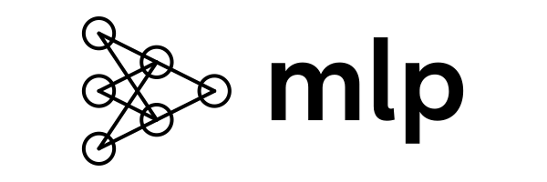

<h1 align="center">
  <picture>
    <source
      media="(prefers-color-scheme: dark)"
      srcset="assets/banner/mlp-dark.svg"
    >
    
  </picture>
   
  <small>multilayer-perceptron: simple neural network</small>
</h1>

    <picture>
      
    </picture>
    <picture>
      
    </picture>
    <picture>
      
    </picture>

This project implements a simple **Multilayer Perceptron (MLP)**, a fundamental type of neural network commonly used in machine learning for tasks such as classification and regression.

The goal of this project is to provide an understanding of how MLPs work and how they can be implemented from scratch, without relying on high-level libraries like TensorFlow or PyTorch.

## Table of Contents

- [Introduction](#introduction)
- [Installation, Configuration & Usage](#installation-configuration--usage)
- [Theory Behind Multilayer Perceptron](#theory-behind-multilayer-perceptron)
  1. [Neurons and Activation Functions](#1-neurons-and-activation-functions)
     - [ReLU (Rectified Linear Unit)](#relu-rectified-linear-unit)
     - [Sigmoid](#sigmoid)
     - [Softmax](#softmax)
  2. [Forward Propagation](#2-forward-propagation)
  3. [Loss Functions](#3-loss-function)
  4. [Regularization](#4-regularization)
     - [L1 Regularization (Lasso)](#l1-regularization-lasso)
     - [L2 Regularization (Ridge)](#l2-regularization-ridge)
  5. [Backpropagation and Optimization](#5-backpropagation-and-optimization)
     - [Gradient Descent](#gradient-descent)
     - [Adam Optimizer](#adam-optimizer)
  6. [Gradient Clipping](#6-gradient-clipping)
- [Subject](#Subject)
- [Acknowledgements](#acknowledgements)

## Introduction

The MLP is a type of artificial neural network that consists of multiple layers of neurons, each fully connected to the next *(dense layers)*.
It is one of the simplest forms of neural networks and serves as the foundation for more complex architectures.

An MLP typically has at least three layers:

* Input Layer: Takes the input features of the dataset.
* Hidden Layers: Intermediate layers where the network learns non-linear representations.
* Output Layer: Produces the final prediction, with an activation function suitable for the task (e.g., softmax for classification).

## Installation, Configuration & Usage

The MLP model, along with its architecture and training parameters, is configured via `.pkl` files.\
This allows for a flexible setup where you can easily tweak various aspects of the model without modifying the code.

[Read the Installation, Configuration & Usage Guide.](/docs/usage.md)

## Theory Behind Multilayer Perceptron

### 1. Neurons and Activation Functions

Each neuron in an MLP takes a weighted sum of its inputs, adds a bias, and applies an activation function to produce an output.\
Mathematically, for a neuron $` j `$ in layer $` l `$:

$` z_j^{(l)} = \sum_{i} w_{ij}^{(l)} a_i^{(l-1)} + b_j^{(l)} `$

Where:
- $` z_j^{(l)} `$ is the weighted input to the neuron.

- $` w_{ij}^{(l)} `$ is the weight connecting neuron $` i `$ from layer $` l-1 `$ to neuron $` j `$ in layer $` l `$.

- $` a_i^{(l-1)} `$ is the activation from the previous layer.

- $` b_j^{(l)} `$ is the bias term.

The activation function $` \sigma `$ is then applied:

$` a_j^{(l)} = \sigma(z_j^{(l)}) `$

This project implements the following activation functions:

#### ReLU (Rectified Linear Unit)

The ReLU function is defined as $` \sigma(z) = \max(0, z) `$.

It is widely used in hidden layers of deep neural networks due to its simplicity and efficiency.\
ReLU is computationally inexpensive and helps mitigate the vanishing gradient problem, which is common with deeper networks.

#### Sigmoid

The sigmoid function is defined as $` \sigma(z) = \frac{1}{1 + e^{-z}} `$.

It maps input values to a range between 0 and 1, making it particularly useful for binary classification problems where outputs can be interpreted as probabilities.\
However, sigmoid activation can suffer from vanishing gradients, which can slow down learning in deeper networks.

#### Softmax

The softmax function is defined as $` \sigma(z_i) = \frac{e^{z_i}}{\sum_{j} e^{z_j}} `$ for each class $` i `$, where $` z_i `$ is the input to the $` i `$-th output neuron.

Softmax is typically used in the output layer of a neural network when handling multi-class classification problems.

### 2. Forward Propagation

Forward propagation is the process of passing input data through the network to produce an output.
During this phase, the data flows from the input layer, through the hidden layers, and finally to the output layer.\
At each layer, the weighted sum of inputs is calculated, a bias is added, and the result is passed through an activation function.

The output for each layer is computed as:

$` \mathbf{a}^{(l)} = \sigma(\mathbf{W}^{(l)} \cdot \mathbf{a}^{(l-1)} + \mathbf{b}^{(l)}) `$

Where:
- $` \mathbf{W}^{(l)} `$ is the weight matrix for layer $` l `$.

- $` \mathbf{a}^{(l-1)} `$ is the activation vector from the previous layer.

- $` \mathbf{b}^{(l)} `$ is the bias vector for layer $` l `$.

### 3. Loss Function

The loss function measures the difference between the model's predictions and the actual target values.
It is a critical component in training neural networks, as it quantifies the error that the model seeks to minimize.

This project uses **Binary Cross-Entropy (BCE) Loss**, which is suitable for binary classification tasks.
BCE is defined as:

$` \mathcal{L} = -\frac{1}{m} \sum_{i=1}^{m} \sum_{c=1}^{C} y_{i,c} \log(\hat{y}_{i,c}) `$

Where:
- $` m `$ is the number of examples.

- $` C `$ is the number of classes.

- $` y_{i,c} `$ is the true label for class $` c `$ in example $` i `$.

- $` \hat{y}_{i,c} `$ is the predicted probability for class $` c `$ in example $` i `$.

### 4. Regularization

Regularization is a technique used to prevent overfitting, a situation where the model performs well on training data but poorly on unseen data.\
Regularization adds a penalty to the loss function, discouraging the model from fitting the noise in the training data.

This project implements the following regularization:

#### L1 Regularization (Lasso)

L1 regularization adds the absolute value of the weights to the loss function:

$` \mathcal{L}_{\text{L1}} = \lambda \sum_{j} \left| w_j \right| `$

Where $` \lambda `$ is the regularization parameter.

L1 regularization tends to produce sparse models, meaning it can drive some weights to zero, effectively performing feature selection.\
This sparsity can be beneficial when working with high-dimensional data, as it simplifies the model, making it easier to interpret and less prone to overfitting.

#### L2 Regularization (Ridge)

L2 regularization adds the squared value of the weights to the loss function:

$` \mathcal{L}_{\text{L2}} = \lambda \sum_{j} w_j^2 `$

Where $` \lambda `$ is the regularization parameter.

L2 regularization spreads out the impact of the weights, ensuring that no single weight dominates the learning process.\
This helps in creating smoother models that generalize better to new data.
Unlike L1, L2 does not produce sparse weights but rather diminishes them uniformly, making it effective in controlling model complexity.

### 5. Backpropagation and Optimization

Backpropagation is the key algorithm used to train neural networks.
It involves computing the gradient of the loss function with respect to each weight in the network, using the chain rule.
These gradients are then used to update the weights to minimize the loss.

This project implements the following optimizers:

#### Gradient Descent

Gradient Descent is a basic optimization algorithm that updates the weights by moving in the direction of the negative gradient:

$` w_{ij}^{(l)} = w_{ij}^{(l)} - \eta \frac{\partial \mathcal{L}}{\partial w_{ij}^{(l)}} `$

Where:
- $` \eta `$ is the learning rate.

- $` \frac{\partial \mathcal{L}}{\partial w_{ij}^{(l)}} `$ is the gradient of the loss with respect to the weight.

GD is simple and effective for smaller datasets or when computational resources are limited.

#### Adam Optimizer

Adam (Adaptive Moment Estimation) is an advanced optimization algorithm that combines the benefits of AdaGrad and RMSProp.\
It adapts the learning rate for each parameter individually, based on estimates of the first and second moments of the gradients:

$` \theta_t = \theta_{t-1} - \eta \cdot \frac{\hat{m}_t}{\sqrt{\hat{v}_t} + \epsilon} `$

Where:
- $` \eta `$ is the learning rate.

- $` \hat{m}_t `$ and $` \hat{v}_t `$ are bias-corrected first and second moment estimates, respectively.

- $` \epsilon `$ is a small constant to prevent division by zero.

Adam is robust to noisy data and works well with large datasets and parameters, making it suitable for deep learning models.

### 6. Gradient Clipping

Gradient clipping is a technique used to prevent the gradients from becoming excessively large during training, which can cause unstable updates and exploding gradients.

The gradients are clipped to a maximum value $` \text{clip\_value} `$, ensuring they stay within a reasonable range:

$` \text{if } \left\|\nabla_{\theta} \mathcal{L} \right\|_2 > \text{clip\_value}, \quad \nabla_{\theta} \mathcal{L} = \frac{\text{clip\_value}}{\left\|\nabla_{\theta} \mathcal{L} \right\|_2} \cdot \nabla_{\theta} \mathcal{L} `$

Gradient clipping improves the stability of the training process, particularly in deep networks where the risk of exploding gradients is higher.

## Acknowledgements

This project is part of the 42 School curriculum. Special thanks to the 42 School community for their support and resources.
